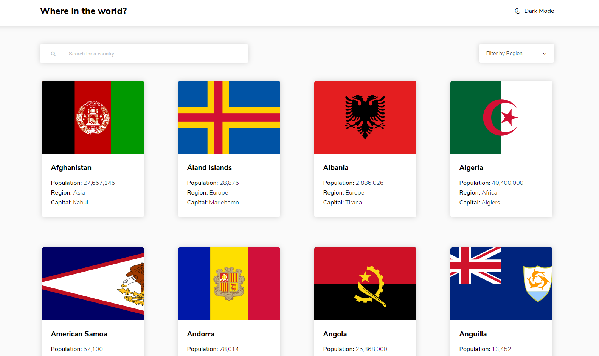
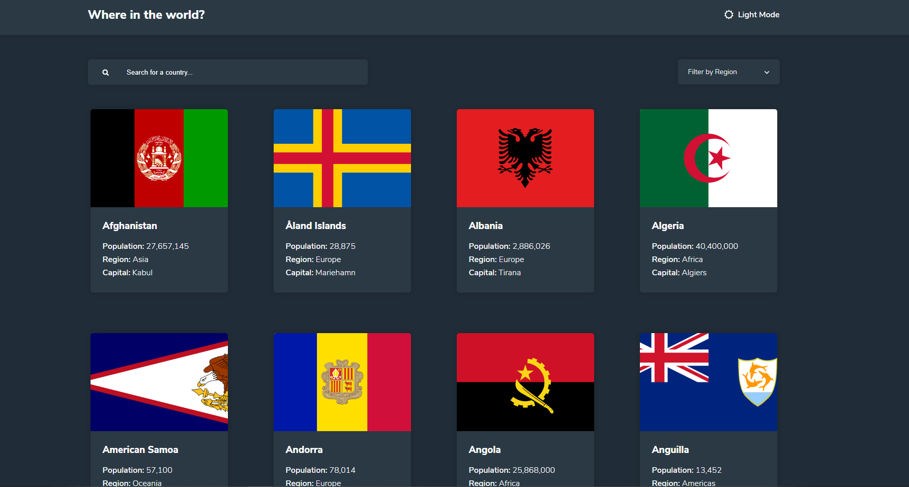
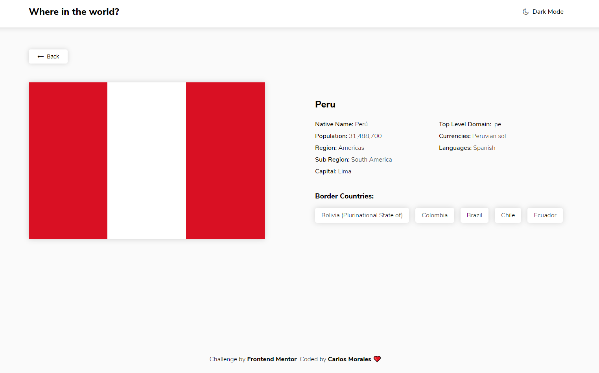
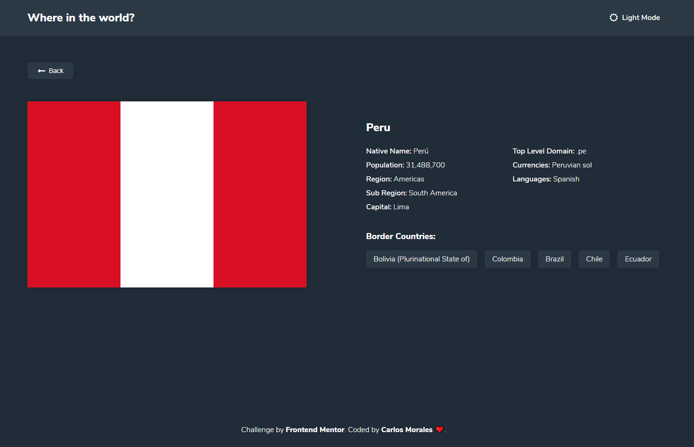
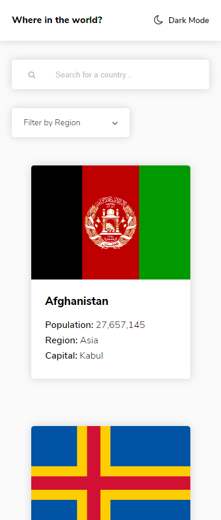
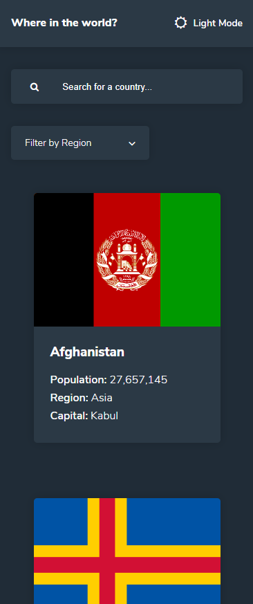
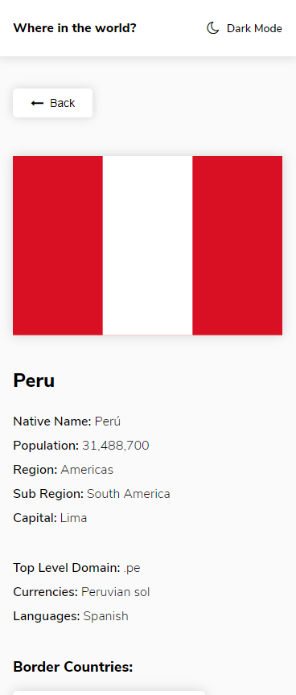
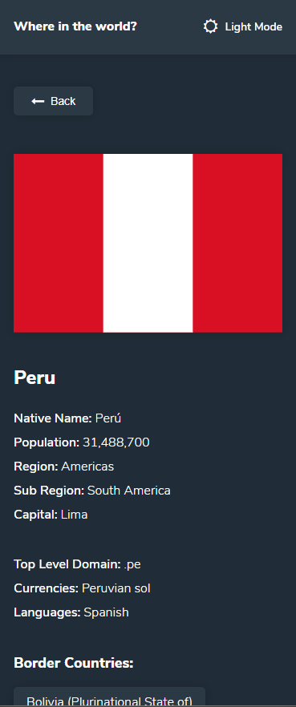

# Rest Countries API

## ✍🏻 Descripción

Realize este challenge de [Frontend Mentor](https://www.frontendmentor.io/) con Angular 9.1.1 en la cual se consume la API de [REST Countries API](https://restcountries.eu) para mostrar todos los paises, filtrar por region, buscar uno en especifico en la region seleccionada y su respectivo detalle de cada uno.
También se añadio un switch para probar el dark mode, el cual se guarda en el Local Storage.

## 🚀 Comenzando

Para iniciarlo debes clonarlo o descargarlo 😊, no olvides correr el comando 👇 para poder comenzar el proyecto.

```
npm install
```

Ingresar en la consola `ng serve` para poner a correr el dev server. Navegart en `http://localhost:4200/`.

## 🎨 Demo

Puedes ver el demo aquí → [Rest Countries API](https://cjosue15-rest-countries.netlify.app/)

<details>

<summary>🖥 Version Escritorio | Light Mode - Dark Mode</summary>





</details>

<details>

<summary>🖥 Version Escritorio Detalles | Light Mode - Dark Mode</summary>





</details>

<details>

<summary>📱 Version Celular | Light Mode - Dark Mode</summary>





</details>

<details>

<summary>📱 Version Celular Detalles | Light Mode - Dark Mode</summary>





</details>

## 🛠️ Construido con

-   HTML
-   CSS
-   JS
-   Angular 9

---

⌨️ con ❤️ por [Carlos Morales](https://github.com/cjosue15) 😊
